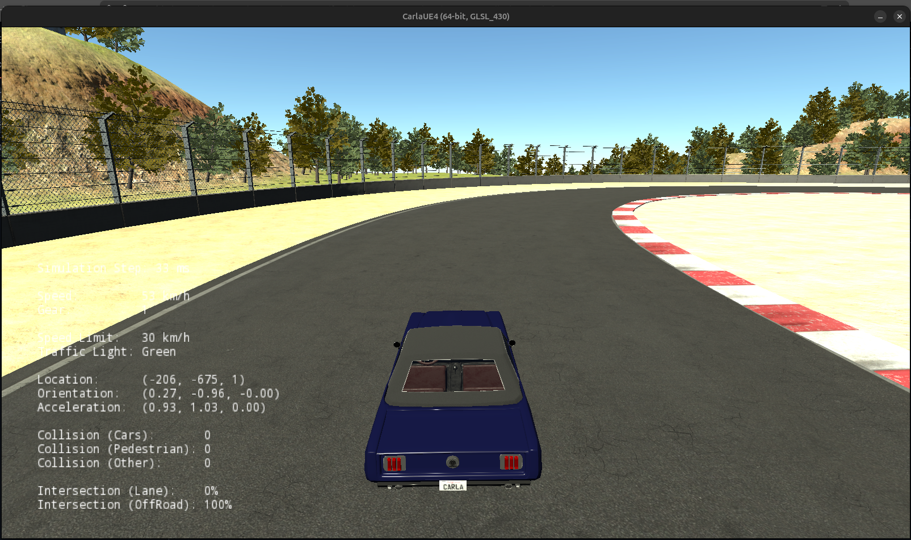
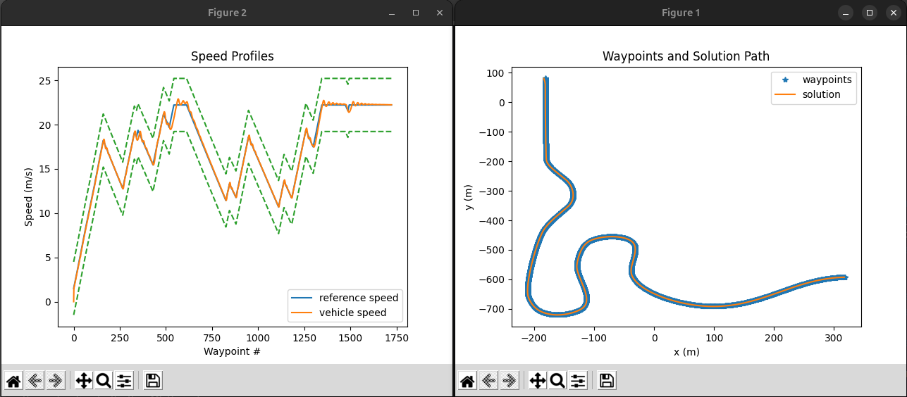

# Final Project Report — CARLA Autonomous Vehicle Controller

This report provides a comprehensive overview of the Final Project for the **Coursera: Introduction to Self-Driving Cars** course. It covers the environment setup, technical control logic, execution workflow, project structure, and final evaluation process.

---

# 1. Project Overview & Environment

The objective of this project is to implement a functional **longitudinal** and **lateral controller** to autonomously navigate a vehicle around a racetrack in the **CARLA Simulator**.

## About CARLA

CARLA is an open-source simulator designed for autonomous driving research. It follows a **Server–Client architecture**:

- **Server:** Handles the physical world, vehicle dynamics, and sensor rendering.
- **Client:** Runs the Python controller code (the “Brain”) that processes state information and sends back control commands.

---
# 2. Project Folder Structure

To ensure reproducibility, this project is designed to run inside a specific CARLA environment. The setup requires **CARLA version 0.9.5 (UE4.18-based build)**.

For simplicity, **only the `Course1FinalProject` folder is included in this repository**, which contains the complete controller implementation. All other components required to run the project (including the CARLA simulator, `PythonClient`, and its internal modules such as `carla/`) are part of the standard CARLA installation and must be installed separately.

Once CARLA is installed, the project folder should be placed inside:

```text
CARLA_ROOT/PythonClient/
```

After setup, the environment can be executed without modifying any core simulator files.
---

## Root Directory — `PythonClient/Course1FinalProject/`

This is the main project folder where all commands are executed.

### `module_7.py`
**Role:** Main executable script

- Acts as the bridge between the CARLA simulator and the controller logic
- Loads racetrack waypoints
- Sends vehicle state information to the controller
- Applies steering, throttle, and brake commands to the simulator

---

### `controller2d.py`
**Role:** Controller implementation (“The Brain”)

This file contains the complete autonomous driving logic, including:

- PID longitudinal controller
- Pure Pursuit lateral controller
- Persistent variable storage using `self.vars`

---

### `racetrack_waypoints.txt`
**Role:** Reference waypoint file

Contains:

- \(x, y\) waypoint coordinates
- Target velocity values for the entire racetrack

These waypoints define the ideal racing trajectory.

---

### `grade_c1m7.py`
**Role:** Grading utility

Compares the vehicle trajectory against the reference waypoint file to evaluate controller performance.

---

## Output Directory — `PythonClient/Course1FinalProject/controller_output/`

This folder is automatically generated and updated during execution.

---

### `trajectory.txt`
**Role:** Vehicle trajectory log

Stores the exact path followed by the autonomous vehicle during simulation.

This file is used as input for the grading script.

---

### Performance Plot Files (`.png`)

The simulator generates multiple visualizations after execution:

- `forward_speed.png` → Speed tracking performance
- `throttle_output.png` → Throttle and brake outputs
- `steer_output.png` → Steering angle behavior
- `trajectory.png` → 2D visualization of the vehicle path

---

## Folder Workflow Summary

The project execution follows this workflow:

1. **Input:**  
   `module_7.py` reads waypoint data from the root directory.

2. **Processing:**  
   `controller2d.py` computes steering and speed control commands.

3. **Output:**  
   Simulation data and plots are written into the `controller_output/` folder.

4. **Grading:**  
   `grade_c1m7.py` compares:
   - `racetrack_waypoints.txt`
   - `controller_output/trajectory.txt`

   to evaluate overall controller accuracy.

---

## Simulator Setup

To ensure stable simulator physics and maintain synchronization with the controller logic, the simulator must run at a fixed frame rate.

Run the following command in the terminal:

```bash
./CarlaUE4.sh /Game/Maps/RaceTrack -windowed -benchmark -fps=30
```

---

# 3. Technical Implementation: The Controller

The core of the project involved modifying `controller2d.py` to convert waypoint data into steering, throttle, and brake commands.

---

## A. Persistent Variable Storage

A controller cannot function effectively if it only understands the current frame. To maintain continuity between frames, persistent variables were implemented using `self.vars`.

### Variables Implemented

- `v_error_prev`  
  Stores the previous velocity error for derivative calculations.

- `v_error_integral`  
  Accumulates velocity error over time for integral control.

- `t_prev`  
  Stores the previous timestamp to calculate the time delta (\(\Delta t\)).

- `last_index`  
  Tracks the vehicle’s progress along the waypoint list to ensure the Pure Pursuit controller always selects a forward waypoint.

These variables allowed the controller to maintain smooth and stable behavior across simulation frames.

---

## B. Longitudinal Control — PID Controller

To manage the vehicle’s speed, a **PID (Proportional–Integral–Derivative)** controller was implemented.

The controller calculates the velocity error between:

- Desired speed: v(set)
- Current speed: v(curr)

### PID Components

### Proportional Term (\(K_p\))

Adjusts throttle based on the current speed error.

### Integral Term (\(K_i\))

Accumulates past error to eliminate steady-state error, such as speed drops on inclines.

### Derivative Term (\(K_d\))

Predicts future error trends to reduce overshoot and improve stability.

---

## C. Lateral Control — Pure Pursuit

For steering control, the **Pure Pursuit** algorithm was implemented.

This method treats the vehicle as a moving point that continuously attempts to “chase” a look-ahead waypoint on the track.

### Look-Ahead Distance (\(L_d\))

The look-ahead distance was dynamically scaled with speed:

- Lower speeds → shorter look-ahead
- Higher speeds → longer look-ahead

This improves steering smoothness and high-speed stability.

---

### Steering Angle Calculation

The steering angle was computed using the Pure Pursuit geometric relationship:

δ = arctan((2L sin(α)) / L_d)

Where:

- L: wheelbase of the vehicle
- α: heading angle to the target waypoint
- L_d: look-ahead distance

---

# 4. Execution Workflow

The project uses a multi-terminal workflow to separate the simulator environment from the controller logic.

---

## Terminal 1 — Launch the Simulator

```bash
./CarlaUE4.sh /Game/Maps/RaceTrack -windowed -benchmark -fps=30
```

---

## Terminal 2 — Run the Controller

```bash
python3 module_7.py
```

This script:

1. Loads racetrack waypoints
2. Feeds them into the controller
3. Computes steering, throttle, and brake commands
4. Sends control outputs back to CARLA

---

# 5. Autonomous Vehicle Execution

During execution, the vehicle autonomously follows the racetrack using the implemented PID and Pure Pursuit controllers.

---

## Autonomous Driving Output

> 

---

# 6. Grading and Verification

After completing the track, the simulator generates a `trajectory.txt` file containing the exact trajectory followed by the vehicle.

The grading script compares this trajectory against the expected racetrack waypoints.

---

## Grading Command

```bash
python3 grade_c1m7.py racetrack_waypoints.txt controller_output/trajectory.txt
```

---

## Evaluation Metrics

The implementation is evaluated using three major criteria:

### 1. Waypoint Tracking

Checks whether the vehicle successfully passes near every waypoint.

### 2. Crosstrack Error

Measures how far the vehicle deviates from the center of the racetrack.

### 3. Speed Tracking

Verifies whether the vehicle follows the required speed profile throughout the lap.

---

# 7. Grading Visualization

After grading, the output displays the vehicle trajectory compared against the expected racing line and waypoint targets.

---

## Grading Output Visualization

> 

# 8. Summary

By combining:

- **PID control** for longitudinal speed regulation
- **Pure Pursuit** for lateral steering control

a robust autonomous driving system was successfully implemented.

Persistent variables enabled smooth frame-to-frame control behavior, while the CARLA simulator provided a high-fidelity testing environment to validate the controller on a complex racetrack.

The final implementation successfully demonstrated:

- Stable waypoint tracking
- Controlled steering behavior
- Smooth velocity regulation
- Autonomous lap completion within grading constraints

---
